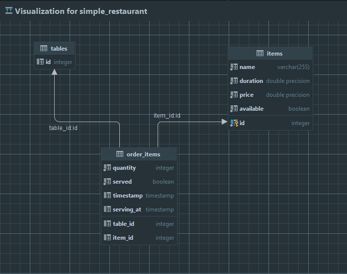

# Simple Restaurant Api

## Context

This application was created to resolve this problem : https://github.com/paidy/interview/blob/master/SimpleRestaurantApi.md
This git repository contains the server application.

You can find the client application [here](https://github.com/Rafeen/simple_restaurant_client)

## Prerequisites

- [RUST](https://www.rust-lang.org/tools/install)
- [DOCKER](https://docs.docker.com/get-docker)

## API Documentation (Postman)
https://documenter.getpostman.com/view/19630547/UzXLyd44

## Build & Launch the Application
At first clon the repository using `git clone https://github.com/FlyLikeAPenguin/RustSimpleRestaurantApi.git`
To build and run this application, apply theses commands in the project folder
```sh
docker compose up / docker compose up -d
cargo build
cargo run
```
To  run tests
```sh
cargo test
```

The application will run on
```sh
IP = 127.0.0.1
PORT = 3000
```
If PORT: `3000` is being by used by another program it can be changed from `Rocket.toml` file

## Database Schema


## License

MIT


